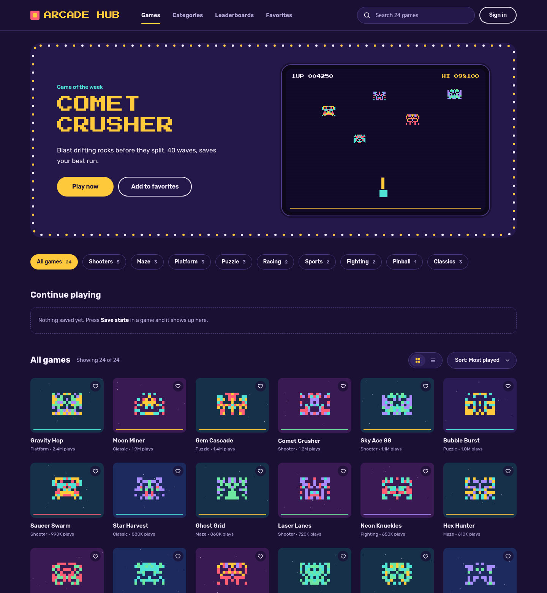
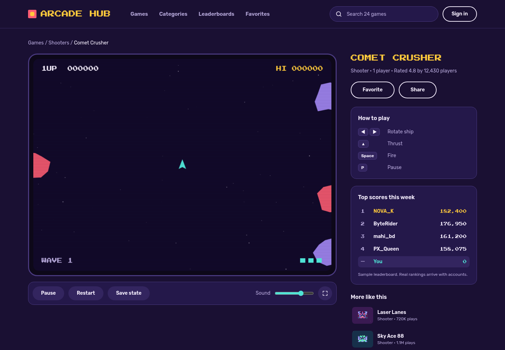
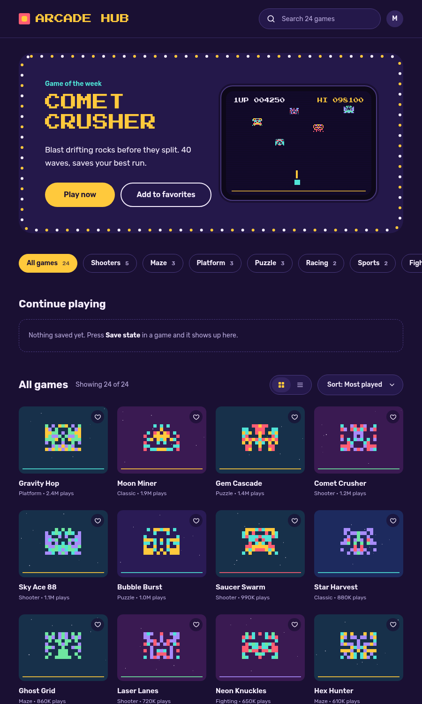
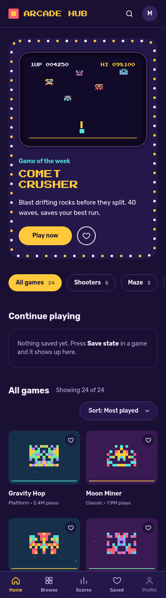
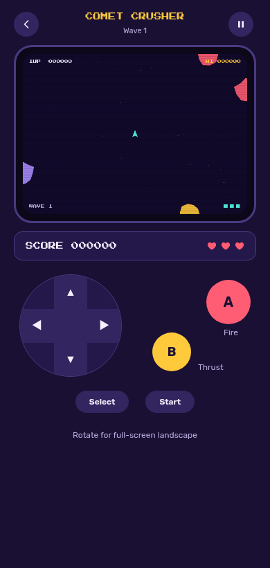

# Arcade - 100 Classic Games on the Web

A web app that runs 100 classic arcade-style games with modern visuals, accounts, verified leaderboards and cloud saves. Games run in the browser (Canvas 2D); the backend handles accounts, scores and anti-cheat.

> Status: **early implementation.** Done: monorepo, game engine, one playable game (Comet Crusher), and the web app (Home, Game player, responsive layouts) built from the design in [docs/design/](docs/design/). Not started: backend (`apps/api`), accounts, verified leaderboards, the other 99 games.

## Live demo

<https://arcade-game-8nptha4pp-acme-372b.vercel.app/>

Hosted on Vercel as a static preview. Visitors may see a Vercel login page until Deployment Protection is turned off for the project.

## Screenshots

**Desktop home**



**Desktop game player** (Comet Crusher, running)



**Tablet and mobile**

<p>
  
  
  
</p>

Design reference: [docs/design/](docs/design/). Differences from the design are listed in [docs/DESIGN.md](docs/DESIGN.md).

## Documentation

| Doc | Purpose |
|---|---|
| [docs/DESIGN.md](docs/DESIGN.md) | UI design tokens, breakpoints, screens |
| [docs/TECH_STACK.md](docs/TECH_STACK.md) | Chosen technologies and why |
| [docs/ARCHITECTURE.md](docs/ARCHITECTURE.md) | System design, game contract, engine, archetypes |
| [docs/BACKEND_API.md](docs/BACKEND_API.md) | REST endpoints, jobs, rate limits |
| [docs/DATABASE.md](docs/DATABASE.md) | Postgres schema and Valkey keys |
| [docs/GAME_CATALOG.md](docs/GAME_CATALOG.md) | The 100 games with archetype and size |
| [docs/ROADMAP.md](docs/ROADMAP.md) | Milestones and build order |
| [docs/GAME_SPEC_TEMPLATE.md](docs/GAME_SPEC_TEMPLATE.md) | Spec to write before each game |
| [docs/STYLE_GUIDE.md](docs/STYLE_GUIDE.md) | Code and visual conventions |
| [docs/TESTING.md](docs/TESTING.md) | Test strategy and CI gates |
| [docs/LEGAL.md](docs/LEGAL.md) | IP/trademark policy |
| [CLAUDE.md](CLAUDE.md) | Instructions for AI coding sessions |

## Stack at a glance
TypeScript monorepo (pnpm + Turborepo) - Vite + React web app - custom Canvas 2D engine - Fastify API - PostgreSQL + Drizzle - Valkey (leaderboards, queues) - Vitest + Playwright.

## Quick start
Requires Node 22+ and pnpm 9 (`npm i -g pnpm`).
```
pnpm install
pnpm dev          # web on http://localhost:5173
pnpm test         # engine + game tests (determinism, invariants, save/load)
pnpm typecheck
pnpm build
```
Backend commands (`docker compose up`, `db:migrate`) arrive with `apps/api`.

## Layout
```
apps/web           React + Vite + Tailwind app
packages/engine    game loop, input, audio, seeded RNG, headless runner
packages/games     playable games, lazy-loaded one chunk each
packages/shared    catalog and types (moves to the API later)
```

## Core ideas
- Every game is a **pure, deterministic module** (seeded RNG, fixed 60 Hz step) so the server can re-simulate replays and verify scores.
- Games are grouped into ~14 **archetypes** so 100 games are built in waves, not from scratch.
- Original art, audio and (where needed) names; see [docs/LEGAL.md](docs/LEGAL.md).
